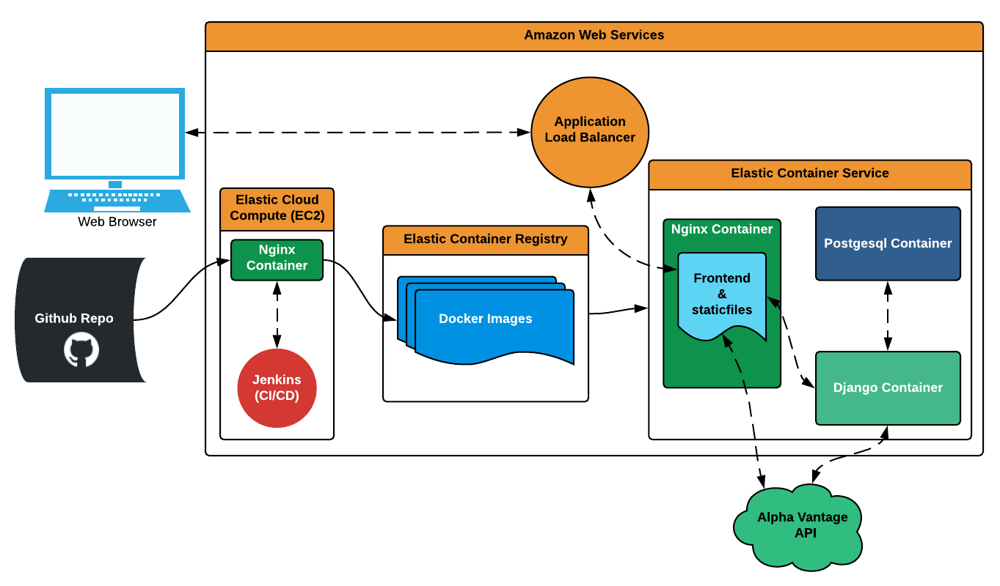
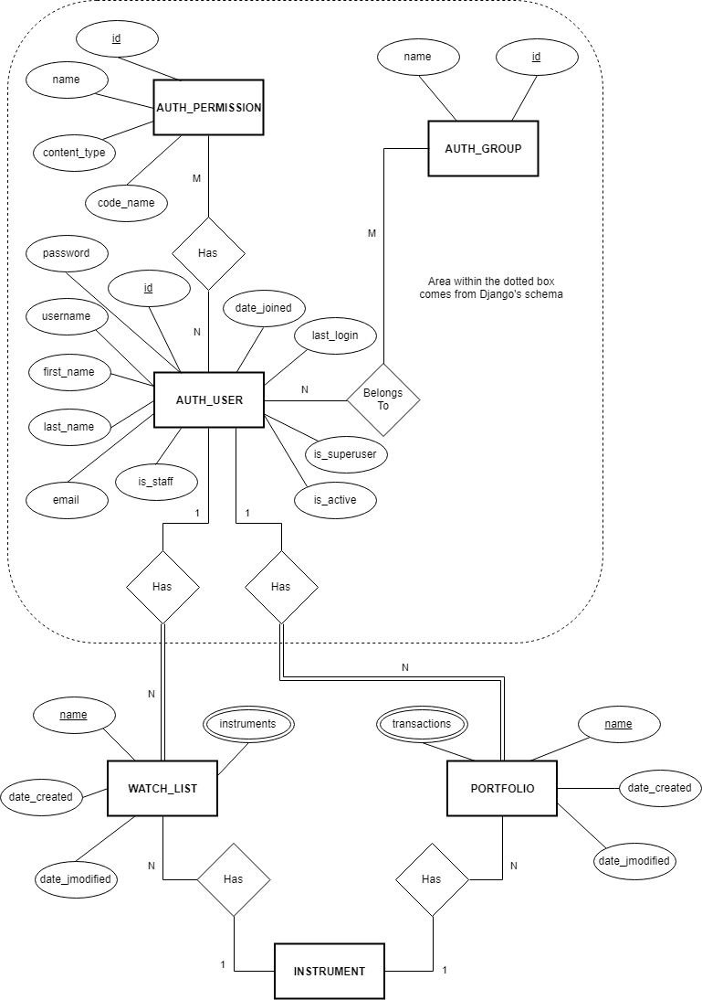

# 1. Introduction
## 1.1 Background
A stock portfolio is a grouping of an investor's stocks held by the investor and/or managed by financial professionals and money managers [1]. A stock portfolio management system is a platform on which one can construct, view, and alter their portfolio and gain information about their portfolio performance, stock trends, and various news and information which could affect these trends.

The problem domain, or scope, of the system is largely comprised of the desired targeted users (i.e. stakeholders, discussed below) and technologies used for development - both defined by the initial requirements of the base system. The project requirements given for the system are that this system must implement the core functionalities provided by Yahoo finance, as well as either extra functionalities provided by Yahoo finance or separate functionalities proposed by the team. "Core functionalities" specifically refers to the creation of a portfolio, addition and deletion of a stock within a portfolio, and refreshing/synchronisation of stocks within the current prices. Further feature proposals are the primary focus of this report and will be further discussed within "Epics" (section 4). The team has also chosen to focus development on a web application, i.e. using a desktop as the targeted platform to run the project.

The stakeholders for a stock portfolio system commonly centre around "investors", who can be defined as "a person or organisation that puts money into financial schemes, property, etc. with the expectation of achieving a profit.". This user base is the common target for stock portfolio systems in general, as they were initially developed as a system concept with these users as the primary target. The project domain will consider this user base, however will be focusing on how to develop a more unique and compact experience given the compact timeline and requirement to develop further features (discussed in "Epics", section 4),

## 1.2 Existing Systems / Drawbacks
The development of this project will be executed with a consciousness of limited time, and as such, a subsequent consideration and integration of existing systems and their drawbacks. The primary example given under this project is "Yahoo! Finance" [2], which is a property of web service provider Yahoo!'s network. It first launched in 1997, and has since evolved into a finance platform that allows users to perform all core functionalities described above, as well as providing larger features on top of this including press releases and financial reports. Features are plentiful within this system, with some strengths being interactive charts on offer, offering performance of the ASX 200, highlighting news relevant to stocks and their subsequent effects, a user customiseable view (e.g. selecting which information to see about stocks), drawing on charts, offering call/put options, and many more. It exists as a virtually complete suite for the experienced investor.

However a common criticism of the Yahoo! Finance platform, common to multiple Yahoo! products, is the overwhelming and busy interface. Ad revenue comprises a large portion of Yahoo!'s total revenue, which often can crowd screen real estate and place less focus on information relevant to the investor and make the UI especially intimidating for inexperienced users. This also results in a slow load time for some pages.

A direct competitor to Yahoo! Finance is Google Finance, which launched in 2006, 9 years after the former. Despite this, Yahoo! Finance remains almost twice as popular as this competitor. Further large competitors often exist as children products to large banking companies, e.g. CommBank's share trading application, and Westpac [3]. Westpac does offer a broad reach with an established user base as well as Yahoo! an offers similar strengths - plenty of context on company stocks and description pages, as well as its own advantages such as easy access to support pages on navigating the site, and escaping the bloating of Yahoo! Finance of having news articles consuming page real estate. However, it still remains cluttered and the UI does heavily require easy support access as to new investors it is fairly non-user friendly.

Numerous, smaller sized competitors exist within the stock portfolio space alongside the above such as Delta [4], and and various mobile applications, each with their own focus and changes to the core functionalities outlined similar to the project specification. Delta specifically offers strengths such as offering different types of charts (beneficial to "charter" types of investors) e.g. line charts and candle charts, a smooth and fluid interface, alerts portfolio graphs, and easy permissible transfer from mobile to desktop. However, there also exist distinct disadvantages such as no Open-high-low-close charts, a lack of information on the platform itself, incompatible mobile/desktop interfacing, and a non-intuitive UI in some aspects (e.g. watch-listing and portfolio buttons difficult to find).

Each platform has a diverse range of strengths and weaknesses, and in many cases the strengths are shared to show which features are often valued the most by targeted users (primarily investors). It is from these systems the team has identified the most important features to have additional to the core product to develop within a compact timeline and limited resources.

# 2. Aim
The main objective of our team is to create a user-friendly stock portfolio management system for consumer investors who wish to track their portfolio performance as well as to follow investment options. The website platform will allow users to manage investment options such as shares, cryptocurrency and foreign currency exchange and provide relevant news information regarding the stock's company. 
Our goal is to differentiate our product from existing services by improving on their aesthetics and some functionalities and thus, creating a more immersive user experience. 
More specifically, they include: 

**Distinction between Portfolios and Watchlists**

In the current portfolio system by Yahoo Finance, the user can integrate the portfolio and watchlist feature but the complicated user interface can often be confusing. The clear distinction between portfolios and watchlists is beneficial for users to keep track of what they own and what they don't, while easily accessing instruments of which they are interested. 

**Chart Comparison and Analysis** 
The current analytics visuals such as the charts provided by Commonwealth Bank mobile application can be improved by presenting more meaningful data. Currently, the comparison chart between two stocks are simply displayed on the same chart. However, by normalizing the data, the user will be able to obtain more meaningful comparison between different datasets.  

**Inclusion of Cryptocurrency**
Although some platforms such as Yahoo! Finance includes cryptocurrency, many platforms still lack this inclusion even though cryptocurrency is recently becoming one of the most popular investment options. 

# 3. Technical Details
## 3.1 System Architecture

 

### React (Frontend & staticfiles)

The React JavaScript framework was chosen for building the user interface for this application. It was selected for its popularity, performance, and abundance of libraries and documentation. Our approach was to compile the front-end to a single-page application (SPA), which would be served by Nginx. The SPA is hydrated client-side, by API requests to either the Django application or to the Alpha Vantage API [5,6].

### Django/Gunicorn

The back-end developed in the Django framework will be served by Gunicorn, a Python WSGI HTTP Server. Gunicorn was chosen as is suitable for handling load well. This is due to its ability to parallelize processes, and its optimisation for speed. One drawback is it's poor ability to serve static files (the React front-end), however Nginx is often used to serve this purpose [7].

### Nginx

Nginx is used as a reverse proxy and load balancer for the Django/Gunicorn server. It also is able to serve static content (the React SPA) without putting any additional load on the Django/Gunicorn application [8].

### Postgresql

Postgresql will be used as a database for the Django application. It has a single port exposed to the Django application container, meaning that it is quite secure and cannot be accessed externally to the Virtual Private Cloud. For more detail on the design of the Postgresql database see the included ER-Diagram.

### Docker

The Nginx server, the Gunicorn server running the Django app, and the Postgresql server are all running each in their own container. This means that the application can be tested locally in an environment almost identical to the production environment (on AWS) [9].

### AWS

The containers will be deployed to AWS. This will also allow us to make use of Amazon Web Services various services such as domain name registration, load balancing services, if we feel later that they are required.

### Jenkins

In order to minimise integration issues, testing issues, code styling and quality, deployment etc., we will be using Jenkins as our Continous Integration pipeline. This too, will be deployed on AWS and will be used to perform automaticated git polling, testing, building with an aim to deployment.

## 3.2 ER Diagram 
#

# 4. Epics

We have split the epics according to the core functionality of our project. 
Some features out of the scope are planned to be attempted if the time permits. 
Please refer to Section 6 about the length of sprints. 

## 4.1 User Management 

**Epic Size: Medium**

**Difficulty: 3/10**

**Time Unit: 1 Sprint**

The user management involves securely logging in and out of the user as well as creating and deleting a user's account. 
The "Log in" feature will take a username and password and will allow a registered user to login to their account and access their portfolio. 
The "Create Account" page will display a list of input fields which will respond with warnings and not proceed if incorrect information is given. 
The "Log out" option will be accessed from the navigation bar and the user will be able to log out securely at any time. 
The "Delete Account" option in the setting will prompt the user to give the password again to ensure that the actual user is deleting the account. 

These pages and features will be easy-to-find and have a minimalist design to ensure a user can easily navigate and use the features without difficulty. 

| Features | Sources |
| - | - |
| "Log in" feature with username and password and a link to create an account | Yahoo! Finance, Google Finance |
| "Create Account" | |
| "Log out" option on the navigation bar in every page | |
| "Delete Account" option in the "Setting" page | |

**User Story and Functional Acceptance Criteria:**

* As a user, I want to securely log into my account to access my portfolio and watchlists. 

> * The user can login if their credentials are validated and correct upon clicking the login button. 
> * If the input by user is incorrect, they will get an error message such as "Either the username or the password were incorrect". 
> * If the user is not registered, they can click "Register" and they will be taken to the "Create Account" section. 

* As a user, I want to make an account to make a portfolio and access the site. 

> * The user can make an account by providing details that are needed to make their account. 
> * The system checks if there is an existing profile that matches the given information. 
> * If there is an existing user, the user is asked to Login, otherwise the user is registered. 

* As a user, I want to be able to log out at any time to keep my portfolio secure. 

> * The user can logout of the application by clicking the logout button. 
>* Logging out removes all authentication information from the application. 
>* After logging out, the user is redirected to the main page. 

* As a user, I want to be able to delete my account securely. 

> * A user can delete their account by clicking "Delete Account" button in their Settings page. 
> * The user will be prompted with a message such as "Do you really wish to delete this account?"
> * Upon clicking "Yes", the account will be removed from the system and all related information such as user credentials and the portfolio will be removed. 

Some features that are out of the scope are password recovery option if the user forgets their password and email verification system when a user creates an account. 

## 4.2 Portfolio Management 

**Epic Size: Large**

**Difficulty: 7/10**

**Time Unit: 2 Sprints**

The portfolio screen will display a summary of the user's portfolio, analysis of its value and performance as well as an overview of what they hold. 

|Features|Sources|
|-|-|
|Portfolio description (performance today, overall return, portfolio cost, value, dividends, etc.) | Yahoo! Finance, Google Finance |
|Analytical charts for value and performance | |
|Holdings List | |
|General navigation bar including a search option | |

User Story and Functional Acceptance Criteria: 
* create
* update 
* lots 

**User Story and Functional Acceptance Criteria:**

## 4.3 View and Search Instruments 

**Epic Size: Medium**

**Difficulty: 4/10**

**Time Unit: 1.5 Sprints**

This feature involves searching for a specific instrument and 
The individual stock page will contain a news feed with information that could be affecting the stock performance. 

|Features|Sources|
|-|-|
|Search bar in the navigation menu on every page|Yahoo! Finance, Google Finance|
|List of matching stocks/companies for a search keyword||
|Individual pages for a stock and the company||
|Recent announcements about market-sensitive information ||

**User Story and Functional Acceptance Criteria:**

* As a user, I want to search a specific instrument to add to my portfolio or watchlist. 

> * The user can search for an instrument by putting the name in the search bar. 
> * The system will return either the specific instrument or a list of possible instruments according to the user input. 
> * If there is no close match, the system will return a message similar to "No Results"

* As a user, I want to view individual stocks page to gain a deeper understanding about the company as well as to view their announcements. 

> * 

Features out of this scope include a news feed with relevant updates for individual stocks and companies. 

## 4.4 Watchlist 

**Epic Size: Medium**

**Difficulty: 5/10**

**Time Unit: 1.5 Sprint**

A watchlist is a list of stocks being monitored for potential trading or investing opportunities. An investor or trader may create a watchlist of several, dozens or even hundreds of trading instruments to make more informed and opportune investment decisions. A watchlist can help an investor track companies and stay abreast of financial or other news that could impact these instruments. [10]

|Features|Sources|
|-|-|
|List of stocks that a user follows |Yahoo! Finance, Google Finance|
|"Add" button on the watchlist page||
|"Add to Watchlist" button on individual stock pages ||
|

**User Story and Functional Acceptance Criteria:**

* As a user, I want to add instruments to the watchlist to follow their performance. 

> * A user can add an instrument by clicking the add button and searching for its name. 
> * Alternatively, the user can search for an instrument first, and click the "Add to Watchlist" button. 

* As a user, I want to be able to delete instruments on my watchlist to only keep the instruments of which I am currently interested. 

> * A user can delete instruments off their watchlist by clicking the delete button for the instrument. 

Features that are out of the scope include moving the instruments around to an order the usr wants in their watchlist. 

## 4.5 Company Management
**Epic Size: Small**

**Difficulty: 3/10**

**Time Unit: 0.5 Sprint**

While the project is a platform for consumer investors,

# 5. Final Selection of Epics 
Given the limited time, the epic *4.5 Company Management* will be out of the project scope as it is not a critical requirement of the project spec. 
All other epics will be included in the project with one sprint to spare if everything goes to the plan. 

# 6. Team Skillset and Project
## 6.1 Technical Experience 
Languages: C, C++, Python, Shell, SQL, Perl, Java, JS, HTML/CSS 

## 6.2 Project Choice 
The choice of our project was based on individual's skills and interests as well as the project's potential for further development and exploration of ideas. 
Initial selection of possible project choices was based on which concept each team member could grasp the best and we were left with the choice of Project 3 and Project 5. 
After analysing the possible solutions for Project 5 and for having an experienced team member (Phet) for this field, we decided to adopt this project. 

# 7. Schedule
Our team will be using Agile methodology with weekly sprints and stand-up meetings. Weekly sprints were chosen instead of the usual fortnightly sprints to make account for the short duration of the project period. Sprint work will be managed on a Trello board and the code will be regularly pushed onto Github Classroom Repository which has already been set up. Team's google drive folder has also been created to share helpful documents. 

## 7.1 Stand-up
* Wednesday, Drum Lab K17, 11:00 - 13:00 (In Person)
* Friday (Online) 
* Sunday (In Person/Online)

## 7.2 Sprints 
* Week 3
* Week 4 
* Week 5
* Week 6
* Week 7 
* Week 8
* Week 9

# 8. References
[1] https://www.investopedia.com/terms/p/portfolio.asp 

[2] https://au.finance.yahoo.com/ 

[3] https://www.westpac.com.au/personal-banking/investments/ready-made-portfolio/ 

[4] https://delta.app/en 

[5] https://love2dev.com/blog/why-single-page-application-views-should-be-hydrated-on-the-client-not-the-server/

[6] https://www.alphavantage.co/documentation/

[7] https://www.fullstackpython.com/green-unicorn-gunicorn.html

[8] https://djangodeployment.com/2016/11/15/why-nginx-is-faster-than-apache-and-why-you-neednt-necessarily-care/

[9] https://opensource.com/resources/what-docker

[10] https://www.investopedia.com/terms/w/watchlist.asp
