\newpage

# 1. Introduction
## 1.1 Existing Systems / Drawbacks

There exist numerous systems , such as Yahoo Finance, Westpac Investing, and Delta, within the stock portfolio management sphere, a few of which were discussed initially by the team when considering areas of focus for the system being developed. 

Initially the approach was designed with core functionalities being inspired by those of *Yahoo! Finance*, a  web service provider Yahoo!'s network. Launching in 1997, Yahoo's popular and widespread service has stock data, portfolio management, as well as features such as press releases, and financial reports drawn from Yahoo! News.

Yahoo! Finance offers these strengths as well as further features, such as interactive charts, user customisation, news highlights relevant to stocks, chart drawing, and performance of the ASX2000. However, there are noticeable drawbacks that accompany these, most notably the busy and bloated interface of the platform. Yahoo! has monetised it's platform through advertisement, which is noticeably present on each page of the platform. As a result, the UI can be cluttered and intimidating for inexperienced users along with a slow load time detrimental to experienced users who's needs are typically more time sensitive.

Further larger entities also exist such as a Google based platform, as well as numerous small and medium sized companies, with startups in the fintech market being a hot spot in recent years. These have also expanded to mobile platforms which allow for a more organic integration with the financial market. A notable smaller platform that was previously cited as a reference is Delta. It has strengths in offering numerous kinds of charts, a smooth interface, and easy transfer from mobile to desktop. However, drawbacks were identified in a non-intuitive UI, little desktop-centred design, no open-high-low-close charts, and a distinct lack of informative on the platform itself, which makes it difficult to use it as a standalone resource.

By identifying the strengths and weaknesses of these existing systems, the team proposed an approach to a fintech system that would incorporate the strengths of established platforms, while navigating away from their the common pitfalls. Many powerful finance platforms, e.g. Yahoo!, hold the necessary information density to be used as a standalone platform which modern systems such as Delta often lack. The team proposed portfolio analyses and detailed company information to step further ahead in this direction. Alongside this, while modern platforms like delta focus on user-friendliness through UI/UX more, powerful and information dense platforms like Google Finance and Yahoo! Finance are often crowded by advertisements or inability to display information in a digestible manner. The team concluded that this needed to be the primary focus; as the interface is often what can make or break a platform for the user. Furthermore, some platforms focus on the addition of news-feeds, to attract both charting and systematic focused investors. It is usually only the blockchain-centred portfolio applications which emphasise a mobile experience. However, whilst the team sought to make this application primarily targeted to desktop, effort was made to ensure it was also highly usable on mobile.

## 1.2 Aim

### Problem Statement

Team MUJEOK_CODERZ within the COMP[39]900 group has undertaken the pursuit of development of a stock portfolio management application that includes the core functionality of a traditional financial platform, such as Yahoo! Finance, while exploring a range of novel features within a compact timeline, utilising limited resources. This product will aim to serve as a platform flexible to desktop and mobile, that is inviting to investors of diverse backgrounds, with a range of needs via an engaging user experience. It pursues the introduction of a modern and approachable system in a seemingly complex and intricate area of interest, allowing a user to access, register, and begin building their portfolio with an informed approach within a matter of a minutes.

### Aim/Purpose
The aim of this project, as supplemented in our given specification is *"to construct a rather traditional application - a stock portfolio management system for financial investment."* By the end of the project, a flexible and lightweight stock portfolio management application would have been built to simulate core functionalities of larger financial platforms with the introduction of further novel features, for the primary benefit of investors and less experienced users wishing to use a fluid platform with digestible and succinct information. The use of external tools and libraries should be utilised to make use of existing solutions as well as a live data feed. 

### Scope

The scope of the project was strictly governed by a short 8-week development timeline with consistent milestones structured to measure progress of the overall project. More explicit details that comprise the scope as a whole include components end-to-end of a standard software development life cycle (SDLC), which will be established and discussed in the Background (Section 2).


# 2 Background 
A stock portfolio is a grouping of an investor's stocks held by the investor and/or managed by financial professionals. It is also given in the specification that a stock portfolio management system is a platform on which one can construct, view, and alter their portfolio and gain information about their portfolio performance, stock trends, while providing relevant news and data that could affect these trends.

The problem domain governing the system is largely comprised of the user base which the system will address and explicit requirements needed by such a financial platform. Core functionalities were initially outlined in the client specification, which specifically referred to the creation of a portfolio, addition and deletion of a stock within a portfolio, and refreshing/synchronisation of stocks within the current prices. The client also requested some innovation beyond these core . 

The user base for the system can also be considered as the stakeholders. The use of the system is strictly defined by the user needs from it. While core functionalities have been specified,  these manifest in practicality when walking through use cases for the system (which are used to define the performance of the system at a more microscopic level). Most stock portfolio management systems exist with the primary target being investors, defined as "a person or organisation that puts money into financial schemes, property, etc. with the expectation of achieving a profit.". Different platforms and features are suited to different types of investors, and the proposed functionality discussed attempts to broaden the user base to attract two major types of investors (those using charts, and those using non visual analysis and company announcements).

The usage domain of this system relies on the proposed features the team has suggested. On top of core functionality, there are novel features that will be implemented that will largely centre around analysis and User-Interaction/User-Experience (UI/UX).

The identified users of the system are largely comprised of consumer investors. An investor is specified as a person or organisation that puts money into financial schemes, property, etc. with the expectation of achieving a profit. It is our intention that this will be aimed not at larger financial organisations, but at consumer-level investors, i.e. those that are not professional share traders. Auxiliary users to this primary user base would not comprise enough of the dedicated user base to be significantly considered when making design choices, and stock portfolio management systems exist for very specialised purposes which due to their nature, often involve steep learning curves for inexperienced users, which runs counter to the purpose of this platform.

A simple usage of the proposed system would be an investor choosing to track stocks of interest. The proposed system should have the functionality to allow the investor to find the proposed stock via an in-built search function, mark the stock to indicate the desire to be notified about significant changes in price or related behaviour, and then be able to receive notifications or observe this in a centralised location. This simple use and others alike are largely encompassed in the domain of portfolio management for consumer investors – which overlooks the entire system. 

## 2.1 System Architecture

To be able to develop the system to the extent intended, numerous third party libraries, tools and services were utilised to be able to increase the diversity of the system and efficacy of the development cycle all within a compact time-frame.

### Major Technologies

**Nginx (Reverse Proxy)** 

{ width=50px }  


Nginx is used used in this application as a reverse-proxy. When it receives requests to `hyperportfol.io/api` it forwards them to the docker container running the Django server, while other requests beginning with `hyperporfol.io` are served the Single Page Application (SPA) compiled from a React Application. Additionally it adds headers for security, and instructions on caching for both the browser and Amazon Cloudfront. (Nginx, 2019)
These can be found in `nginx/default.conf`.

*Licence: 2-clause BSD*


**React (Client)**

{ width=50px }

The React JavaScript framework was chosen for building the user interface for this application. It was selected for its popularity, performance and abundance of libraries and documentation. (React, 2019) Our approach was to compile the front-end to a single-page application (SPA), which would be served by Nginx. The SPA is hydrated client-side, with all API requests directed to the Django application which makes the requests on the clients behalf. This is to ensure that the API keys are kept secure server side instead of being used in the client, potentially exposing it.

A significant portion of the application's logic is performed client-side, such as data aggregation using the d3 package. Though calculating stock and portfolio metrics client-side causes some small decreases in speed; it allows us to reduce server load allowing for increased scalablity, and minimal impact across users from increased server traffic.

_Licence: MIT_

**Django/Gunicorn (Server)**

{ width=50px }

The back-end developed, in the Django framework will be served by Gunicorn, a Python WSGI HTTP Server. (Gunicorn, 2019) Django is used somewhat non-traditionally as a REST API server. (Django, 2019)

Gunicorn was chosen due to its ability to handle load. This is due to its ability to parallelise processes by creating multiple workers, and its optimisation for speed. One drawback is it's poor ability to serve static files, however a separate server can be used to serve this purpose. As our static files were compiled from a React Application and hosted by Nginx, this was of no issue.

_Licence: 3-Clause BSD_


**PostgreSQL**

{ width=50px }

For our database we chose PostgreSQL. (PostgreSQL, 2019) Locally this was run inside of a docker container for our server to connect to, but the live deployment made use of Amazons Relational Database Service (Amazon RDS). The database was mostly handled through a Django object-relational mapping (ORM); though there were some manual creation of Schemas etc as can be seen in the Code Structure further into the report.

_Licence: PostgreSQL License (Free and Opensource)_

### Other Technologies

**RapidAPI Yahoo Finance API**

{ width=50px }

For our primary data source, we used the RapidAPI Yahoo Finance API delivered by API Dojo, which delivers the same data as found on the Yahoo Finance API. This is not officially Yahoo's API but the data is the same as Yahoo Finance's. The API allows us to not only retrieve current stock prices for specific instruments, but also facilitates search, charting and news data. (RapidAPI, 2019)
The data source was originally Alpha Vantage but due to difficulties as discussed in the technical challenges section, we migrated over to this API.

_License: Commercial (Subscription 50,000 API calls per month, $0.0006 per excess call)_


**Cypress** 

{ width=50px }

Used for automated end-to-end testing (e2e), cypress would perform a series of actions to emulate a user navigating our application. (Cypress, 2019) This helped ensure that functionality was not broken during development. For a demonstration, see the DevOps video in the media section of the appendix.

_Licence: GNU GPL_


**Docker & Docker-Compose**

{ width=50px }

Docker was used for *containerising* our application, so that it was easier to develop on multiple systems, reducing issues of differing versioning and packages. (Docker, 2019) It also enabled us to make use of Travis CI/CD (Continuous Integration, Continuous Development) for automated testing (with our e2e tests) and automated deployment. We preferenced Travis over Jenkins as the former was already a hosted service and required minimal setup as opposed to installing, configuring and deploying Jenkins ourselves.

_Licence: Apache 2.0_

**Travis-CI**

{ width=50px }

Travis-CI was used to run our Cypress tests and deployment automatically whenever a change was made to the master branch of our github repo. (Travis CI, 2019) If tests passed, it would be reflected as a build status on github and AWS would be prompted to roll out an update of the more recent version of the application. If the tests failed, a video of the failure would be recorded on `cypress.io` and an email would be sent out. See either the Videos at the bottom of the README.me or in the appendix of this document for a demonstration of this process.

_Licence: MIT_


**Mixed Amazon Web Services**

{ width=50px }

The **Amazon Web Services** used to deploy this application to the web were:

- **Elastic Beanstalk**: Hosting of the application servers on Elastic Cloud Compute (EC2) instances.
- **RDS**: A Relational Database Service running PostgreSQL.
- **Route53**: Domain name registration.
- **Cloudfront**: Reduces load times through caching static content on a Content Delivery Network (CDN).
- **Certificate Manager**: HTTPS Certificate acquisition.
- **Virtual Private Cloud (VPC) & Security Group**: Kept exposed ports strictly within a virtual network so that Docker Containers could interact with each other, without being able to be accessed from the internet (With the exception of port 80 on the nginx server.

Combined these services ensure _powerful_ scalability, performance, load-times, and availability. (Amazon AWS, 2019)

_Licence: Amazon Software Licence (Paid, but with some Free Tier)_

### Licences

For major packages listed above; all are free and open-source (FOSS) with the exception of AWS and RapidAPI. RapidAPI was paid for this project, as our API calls overwhelmingly exceeded the free tier of AlphaVantage and their next tier would have been out of budget. AWS cost a small amount for domain registration, and a Cloudfront, but the elastic beanstalk is within the free tier.

The Highcharts package was also a paid product, used within its free-tier, which included brand watermarks. (Highcharts, 2019)

Overall this means that this project is under no risk of breaching any licenses. Where non-FOSS technologies have been used, they have been payed for according to their plan, and the design of our system has been with these services and their scalability at higher price ranges in mind.

*A summary of licences for smaller packages can be found in the appendix.*

## System Architecture Diagram

A system architecture diagram has been produced to depict a holistic view of the system and its technologies, and how said technologies both fit into each other and are used within a broader pipeline to achieve desired functionalities.

### The Deployment Architecture


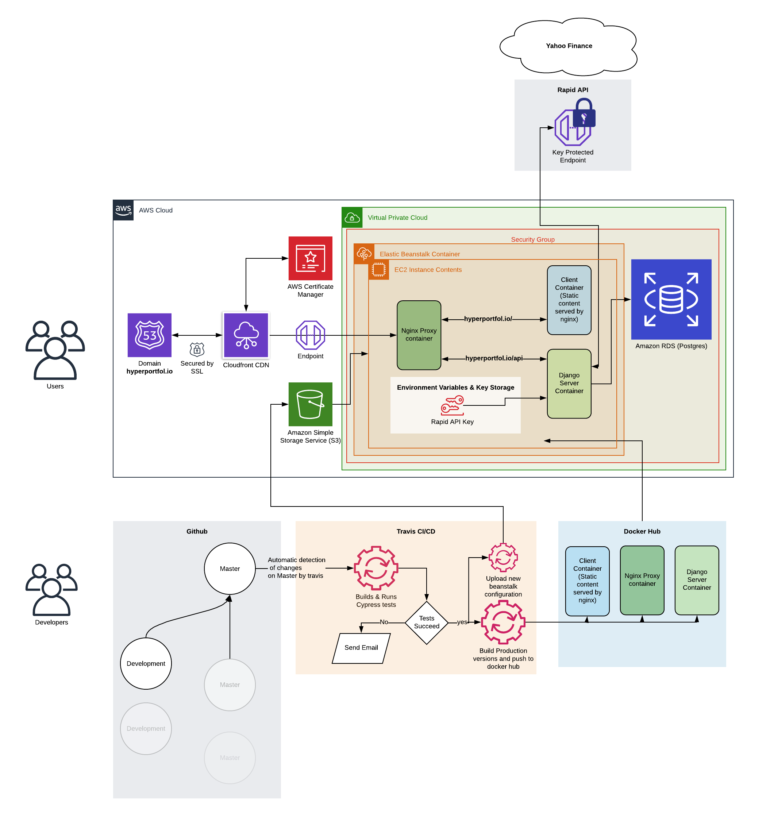

_Systems Architecture Diagram_

The function of all technologies in this diagram can be found under the  **Major Technologies** and **Other Technologies**  earlier in Section 2.2. 

### Client Server Diagram


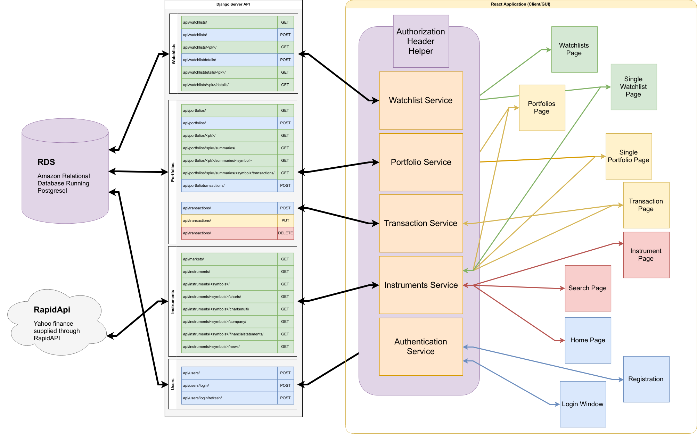{ width=450px }

_Client Server Diagram_

The role of the `.jsx` React Components, such as the Login Window, can be found described in more detail in section 3.


## 2.2 ER Diagram

An ER diagram has been produced to articulate the relationships between the data fields utilised within the system and their relevant interactivity with each other to enable to desired functionality.


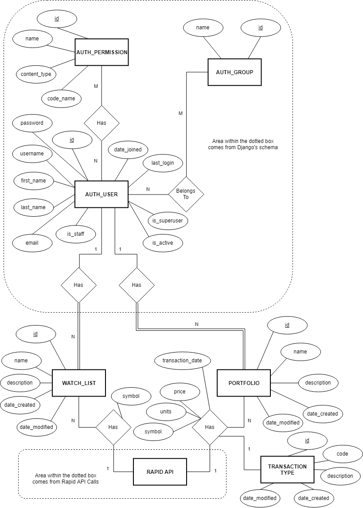


The following Relational Data Model is derived from the ER diagram. NOTE: We did not include the Django generated AUTH_* tables as they are publicly available at:  
https://docs.djangoproject.com/en/2.2/ref/contrib/auth/


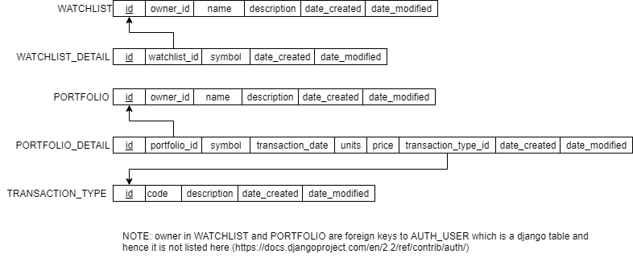

_RDM_

\pagebreak

# 3. Contributions 

This section first analyses Hyperportfol.io against the project proposal's user stories and then, demonstrates the functionalities of the final product. The epics which were selected to be **out-of-scope** are not included. 

## 3.1 Implementation Check Table 

**User Management**

| Original User Stories| Implementation Status |
| - | - |
| As a user, I want to securely log into my account to access my portfolio and watchlists. | Implemented |
| As a user, I want to make an account to make a portfolio and access the site. | Implemented |
| As a user, I want to be able to log out at any time to keep my portfolio secure. | Implemented |
| As a user, I want to be able to delete my account securely. | Not implemented because it was **de-prioritized** in the short given amount of time |

**Portfolio Management**

| Original User Stories| Implementation Status |
| - | - |
| As a investor, I want to create portfolio/s to keep track of the stocks I own. | Implemented |
| As an investor, I want to measure and view the performance of my portfolio to inform future investment decisions. | Implemented |
| As an investor, I want to be able to buy or sell stocks and update the portfolio. | Implemented |
| As an investor I want to be able to track when purchases were made so that I can know if certain stocks are under capital gains tax | Implemented |

**Watchlist Management**

| Original User Stories| Implementation Status |
| - | - |
| As a user, I want to add instruments to the watchlist to follow their performance. | Implemented |
| As a user, I want to be able to delete instruments on my watchlist to only keep the instruments of which I am currently interested. | Implemented |

**View and Search Instruments**

| Original User Stories| Implementation Status |
| - | - |
| As a user, I want to search a specific instrument to add to my portfolio or watchlist. | Implemented |
| As a user, I want to view individual stocks page to gain a deeper understanding about the company as well as to view their announcements. | Implemented |


## 3.2 Core Functionalities 

Core functionalities of the system are those which need to be completed to first allow it to be identified as a stock portfolio management system, and assumed priority within the development cycle.

### 3.2.1 User Management 
This functionality involves securely handling user's registration, logging in and logging out. 

The code for the modal form for logging in is found in  
```
frontend/src/components/pages/users/LoginModal.jsx
```
Logging in and authentication depends on functions described in 
```
frontend/src/services/authenticationService.js
``` 

In order to communicate with the Django REST API, (which uses the jwt_views from the rest_framework_simplejwt module via the endpoint `api/login/`) and aquires a JWT token.  
The form data is secure when entered over HTTPS, the default for hyperportfol.io, and JWT tokens ensure the desired security after logging in. Future requests to the API are verified by the JWT token.

*As a user, I want to make an account to make a portfolio and access the site.*
Similar to logging in there is a modal form: 
```
frontend/src/components/pages/users/RegisterModal.jsx
``` 
Registering uses the `authenticationService.register` function in the service file described above.

*As a user, I want to be able to log out at any time to keep my portfolio secure.*
Logging out removes current tokens from session service, so it is impossible to resume the existing session and the user must log in again for a new session. The logout button is located on the navbar, found at 
```
frontend/src/components/navbar/Navbar.jsx
```
Though the logout function can also be found in the `authenticationService` service mentioned above.

*As a user, I want to be able to delete my account securely. *
This function was implemented in the authenticationService, and account deletion was de-prioritized.


| Login Page | Registration Page |
|---|---|
|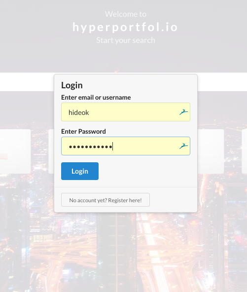{ width=250px}| 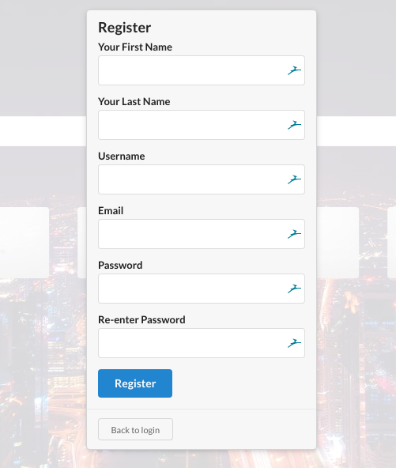{ width=250px } |


### 3.2.2 Portfolio Management

The basic portfolio functionality consists of portfolio summary, creation/deletion of multiple portfolios, buying/selling stocks and listing the current stocks as well as the history of stock transaction. 

Users are able to create portfolios through the portfolio management page navigated to from the Navbar. Once created, stocks can be added from the `Add Transaction` button or from navigating to an Instrument Page for a given stock and clicking the Buy/Sell button.

Once a stock has been purchased, the totals of all buys/sells of that stock will be displayed on the page for the portfolio it was added to. Clicking the stock will take you to all transactions made with that given stock (I.e. all buy/sell orders). A report can be printed of all transactions from the Portfolio Management page.

The code for the portfolio management can be found in: 
```
frontend/src/components/pages/portfolios/
```
For the components, 
```
frontend/src/services/portfolioService.js
```
 for the services for retrieving data from the Django REST API. The code for Django's portfolio endpoints can be found in  `app/portfolios/api/` in the files `serializers.py`, `views.py` and `urls.py`.

Once again JWT tokens mean that authentication is secure, and if the page has been visited recently it will continue the existing session.

*To see examples of this, see the **User Guide** under Appendix A; the fourth and fifth images will show portfolio pages.*

### 3.2.3 Watchlist Management

The watchlist functionality allows the user to create/delete multiple watchlists, add/delete instruments on the watchlist as well as adding from the search results page. 

The watchlist management page, like the portfolio page, had a button for creating new watchlists.
Once a watchlist has been created the small 'Add detail' bar and button on the created watchlist can be used to add stocks to track. Additionally, they can also be added from the search page oriInstrument Page for a given stock.

The code for the watchlist management can be found in:
```
frontend/src/components/watchlists/
```
For the components, 
```
frontend/src/services/watchlistService.js
``` 
For the services for retrieving data from the Django REST API. The code for Django's watchlist endpoints can be found in  `app/watchlists/api/` in the files `serializers.py`, `views.py` and `urls.py`.

*To see examples of this, see the **User Guide** under Appendix A; the second and third images will show watchlist pages.*

### 3.2.4 View and Search Instruments

Instruments can be searched from most pages, and clicking on instruments will take the user to a page of information, news, and charts about that particular instrument. If the enter key is pressed while the search bar is active, the user will be taken to a dedicated search page which will list all results matching their search.

Searching Components are stored in the 
```
frontend/src/components/searchbars/
``` 
folder, whereas the Components for constructing the instrument viewing page can be found in
```
frontend/src/components/pages/instruments/
```
The functions for both viewing instruments and searching for them all fall under 
```
frontend/src/services/instrumentService.js
```

The Django REST API's endpoints for searches and instruments can be found at `app/instruments/api/` in the files `views.py` and `urls.py`.

*To see examples of this, see the **User Guide** under Appendix A; the last two images will show searching and viewing instruments.*

## 3.3 Novelty Features

Novelty features were developed strictly following the completing of core functionalities and served a sa platform to allow the system to extend beyond existing systems and showcase it's uniqueness and what would truly make users choose it over existing platforms.

### 3.3.1 Interactive UX/UI 
As suggested by the project specification, we attempted to produce a "fantastic UI" in many ways including use of  **micro animations**. This is a non-functional feature that significantly improves user experience by providing an immediate feedback to user's movements such as mouse hovering over a button.


Furthermore, various "at a glance" features such as sparklines and mini bars were deployed on the individual portfolios pages, along with the visual indicators such as colours for gain/loss and +/- indicators as well as presenting the best performing shares on the portfolios page.


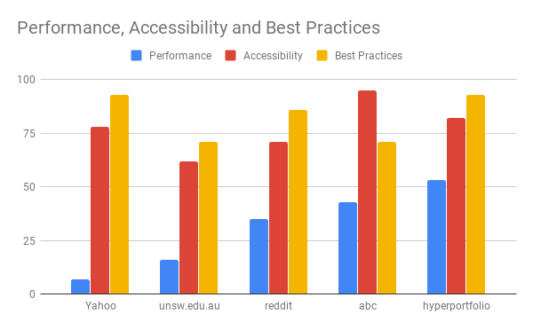{ width=400px }

_Google Auditing Tool Lighthouse Results_

### 3.3.2 Charts Analysis 
As suggested by the project specification, we made use of existing libraries and components and with the implementation of the charting on the instruments page. For this, we used a Stockchart component from Highcharts which allows the configuration of a GUI which contains miscellaneous tools for technical analysis, such as applying indicators such as a Simple Moving Averages to Linear Regression. However to further extend this capability, we implemented searches to add dynamically extra series to the charts to allow us to compare different stocks to each other on top of the chart. It was noted that sometimes an ordinal scale can be insufficient when comparing series on a chart, so we also implemented a control to switch the chart to a logarithmic scale as logarithmic scales are better at comparing rates of change.

For example, in the instruments pages for APX.AX, we may decide that we want to compare against AD8.AX, so beneath the chart, we enter the code ADX.AX into it and select the result. The series is rendered onto the chart is follows:

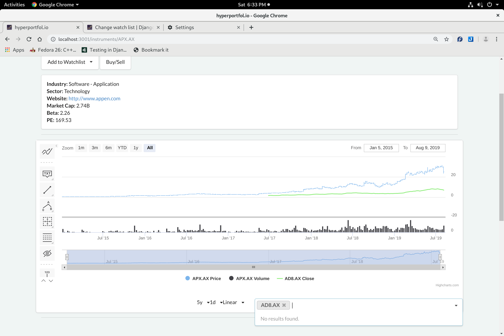{ width=350px }

_Multiple Instruments Comparison_

We're only really interested in the period where both of the codes have been trading so using the range selector, we restrict the period to roughly the latter half of the chart where they were both trading as seen below:

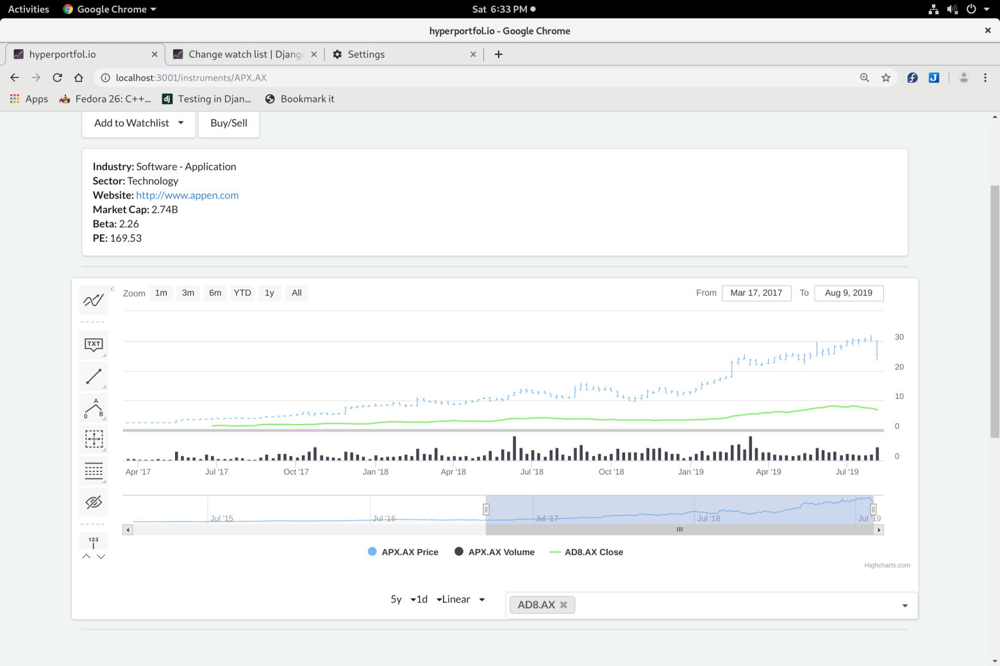{ width=350px }

_Restricted Timeline_

At a glance, AD8.AX appears to be growing much faster than AD8.AX but when we change the y axis to a logarithmic scale, we see that they are roughly changing at the same rate.

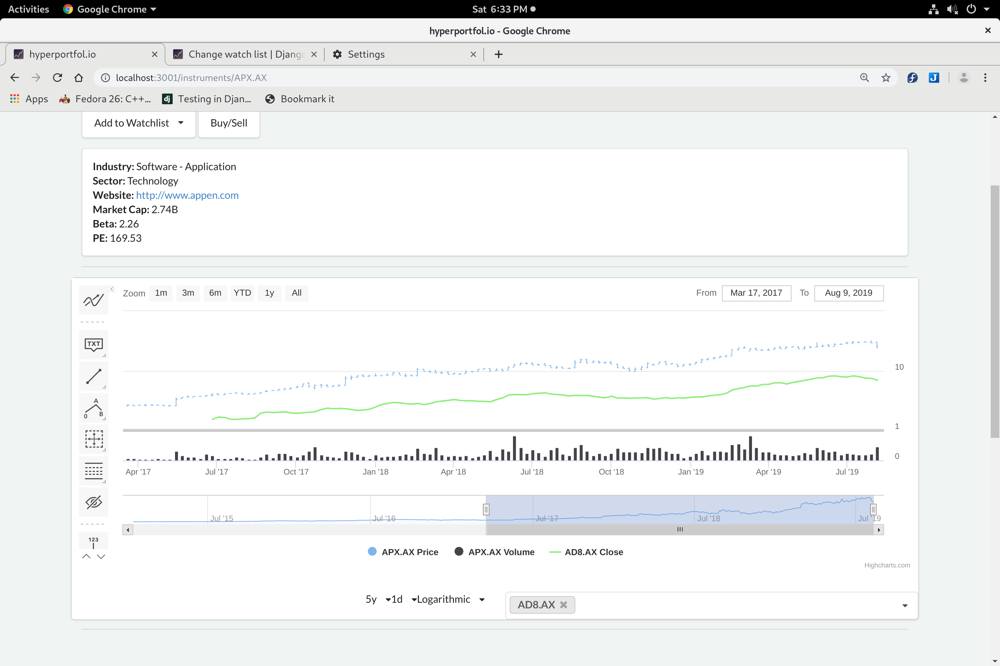{ width=350px }

_Logarithmic Comparison_

### 3.3.3 Related News for Individual Instruments 
In each instrument page, we show a list of news items related to the instrument as it is helpful at times to see what news relating to the company is available on the internet. Using the RapidAPI endpoint we are able to get news feeds onto the page for reference.

However, compared to Yahoo finance which gives a lot of prominence to the news compared to the graph, we feel that the graph is more important and so we have reversed the emphases as news is at best speculative.

| hyperportfol.io | Yahoo Finance |
| --- | --- |
| 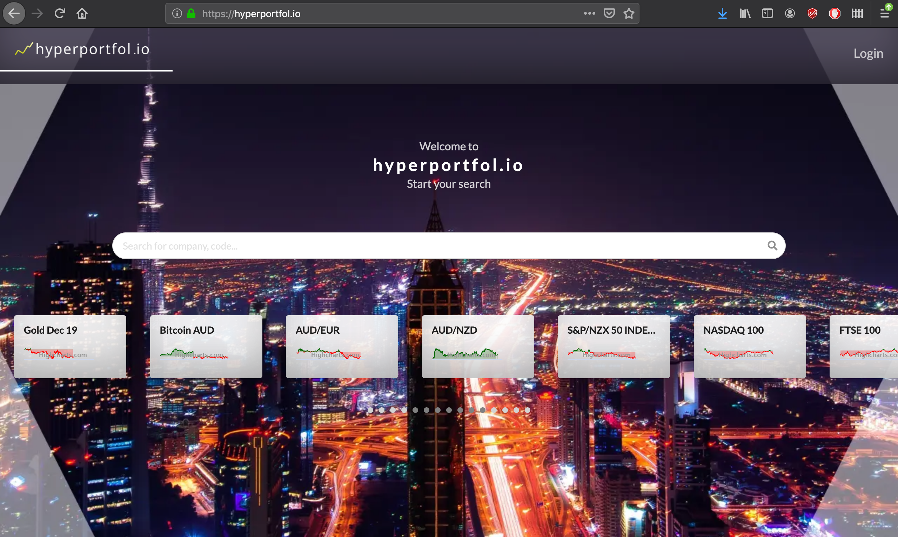{ width=250px } | 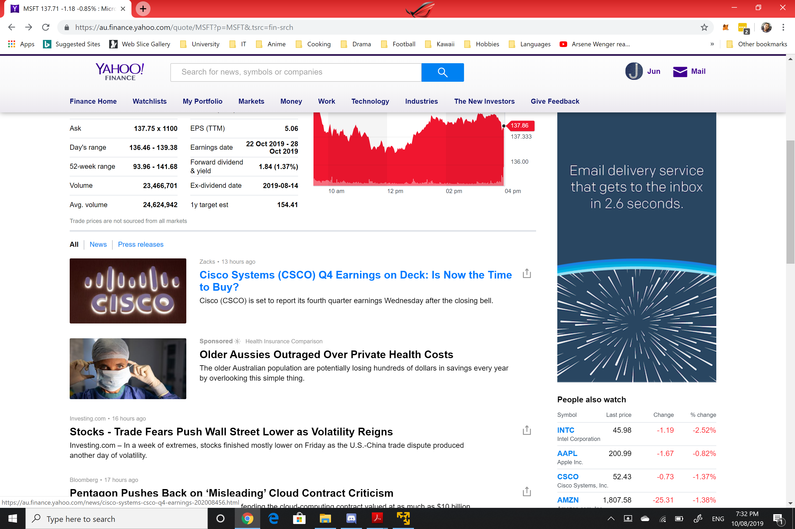{ width=250px } |


\newpage

### 3.3.4 UI Customisation 
Portfolio and watchlist pages can be customised to show selected information, assisting users to quickly find what they need within a mass of data. 

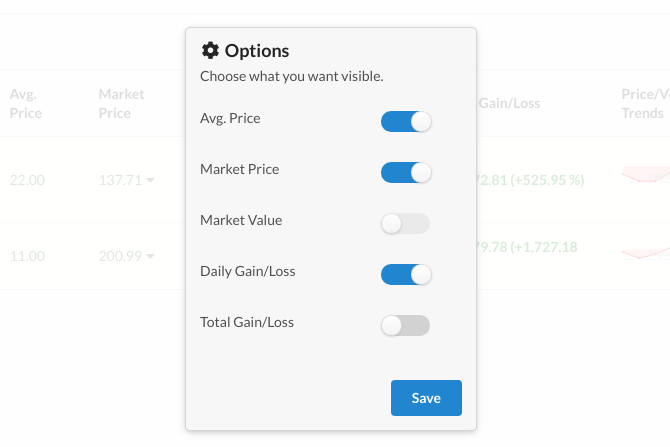{ width=200px } 

_Customisation Settings_

### 3.3.5 Analysis and Reports

As shown under Charts analysis, the system allows us to do some technical analysis using charts under each instrument page. Reports can be generated using the report button on an individual portfolio page; see the User Guide in the Appendix for an example.

# 4. Implementation Challenges

**Moving from AlphaVantage to RapidAPI (Then further yahoo issues)**

Alpha Vantage's free API key had an incredibly low limit on API calls; up to 5 API requests per minute and 500 requests per day (Alpha Vantage, 2019). This limit was further exasperated by the fact that all of Alpha Vantage's end points only requested one symbol at a time, so implementing search was impractical (AlphaVantage, 2019). As a result we opted to move across to RapidAPI's Yahoo finance API. This service provided a greater number of calls and no limit per minute, along  with an end point for searching, as well as the ability to get quotes for multiple instruments, at the cost of both slightly worse speeds and a higher error rate. However, even though we now had a lot more available calls, especially as we were still developing at this point, we were making API calls at a rate much higher than we were expecting to. (RapidAPI, 2019)

To minimise the error rate and the number of calls made, we added the following fixes to the Django code that accesses the RapidAPI calls:
* We started caching the calls with Django's caching decorator to 2 hours. This allowed us to reduce the number of API calls required. Naturally the trade off is that we reduce our accuracy to real time.
* We checked the response if it contains the JSON attrribute on a valid result. The reason for this is that the API doesn't return errors via the HTTP response codes but with a return code 200 but with the error message. As a result we needed to test whether the returned response had the correct attributes.
* Furthermore we added a loop to the calls to keep going unless the return code is 200.
We noticed that errors were still coming so we added a retry method based on a solution recommended from a blog post *"Best practice with retries with requests"* (Peterbe.com, 2019).

**Aggregating data with d3**

The portfolio's view page required aggregated data for portfolio totals and totals of all portfolios along with the best performing shares and worst performing shares. To get the data for these levels, total transactions by the owner, portfolio and symbol levels are retrieved but then need to be aggregated to the appropriate higher levels. As a result, d3 was used as it allowed us to aggregate data to the various groups efficiently.

**Consistency on different platforms**

Early on in the project there were consistent issues standardising the behaviour of the application in development across multiple computers/platforms. We introduced docker into the system to get around this. It also had the bonus of making deployment more straightforward.

**Breaking functionalities**

Any project has the issue of potentially impacting one functionality while developing another. We experienced this issue multiple times; and by the 5th week it was time to bring in end-to-end testing. In order to determine that these sorts of issues would be quickly detected we established an automated testing setup using **cypress**.

**Jenkins to Travis**

Initially we proposed to implement Continuous Integration/Continuous Deployment via installation, configuration and deployment of Jenkins for use in our development process but due to feedback from the tutor that this is out of scope and the effort is best spent within the application itself, we eventually changed to using Travis as:
* It is a hosted solution
* Had a more succinct setup

This allowed us to get some of the benefits of CI/CD.

# 5. Design Considerations

In depiction of the overall system, numerous boundaries and constraints were set by the client and the governing time frame/permitted resources that pushed the team to identify certain design considerations. These ultimately shaped the progression of the project and slowly, the intended finished product.

## Core Functionalities 
### Entering Transactions at Arbitrary Dates (including from a past date)
The system allows us to enter transactions (BUY/SELL) of instruments at arbitrary dates although it defaults to the current date and time. As a portfolio management system (rather than an actual share trading system), the system is designed to allow people to manage their portfolios based on the shares they hold, and/or create portfolios based on hypothetical scenarios etc. In order to achieve this, the ability to create transactions at any arbitrary date is required. The Yahoo! Fiinance system currently allows the user to do the same. 

For example, some scenarios include:

**<Scenario 1: Replicating One's Existing Portfolio>**
A new user John has 1000 shares in Telstra bought over several transactions in the past. He decides to use the Hyperportfol.io system as his existing share trading application, Comsec, only shows recently executed transactions and past transactions need to be retrieved via CSV/XLS download. He would like to just view his past transactions when he wants. As a result, he wants to migrate his past transactions into the Hyperportfol.io system and continue to use that in the future to keep track of all his transactions.


**Scenario 2: Creating a Hypothetical Portfolio**
On the 9th of August, 2019 John is deciding whether or not to buy 200 more Telstra shares but is uncertain. He is NOT confident but he would like to see how it goes if he did. So he creates another portfolio with the same balance of his existing holding and then creates the new hypothethical transaction in this new portfolio. This allows him to see how well or bad it would have went if he did the action.

Furthermore, below is a screenshot which highlights Yahoo! Finance's identical capability of being able to purchase from a past date: 

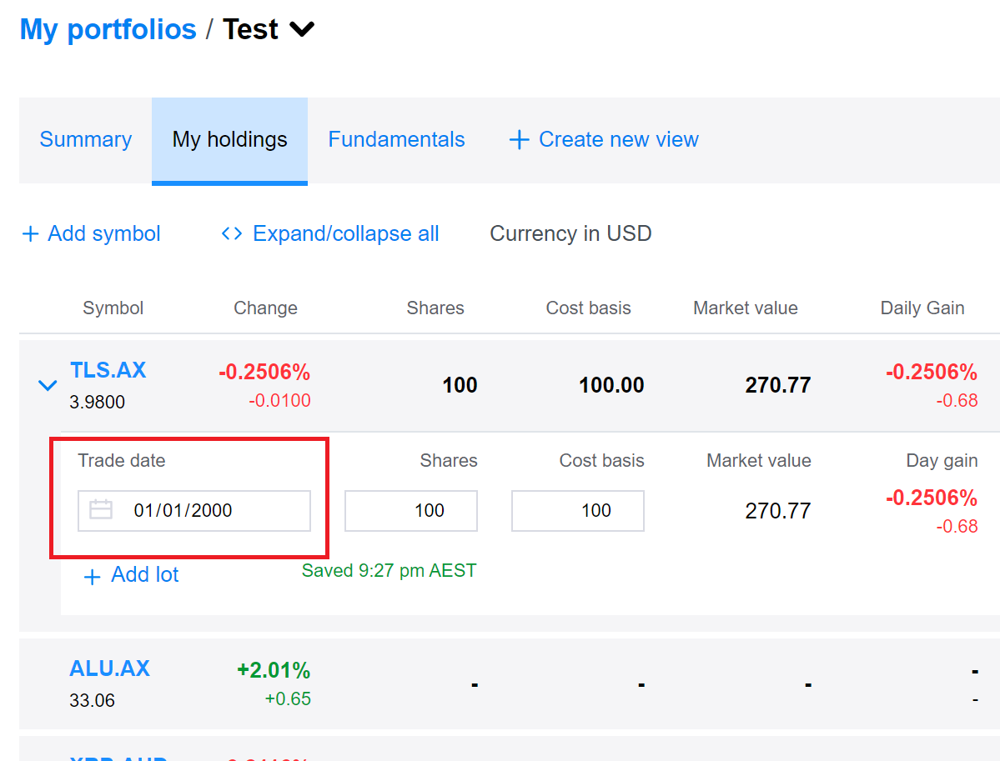{ width=350px }

### Negative Transactions
The Hyperportfol.io does not restrict a user from entering a negative transaction. e.g. Selling shares that a user does not own. At first this may seem like an error or bug, but this has intentionally been allowed in order to facilitate transactions Short Selling. Short Selling is where an investor is speculating on the price of an instrument decreasing, or as given by Commsec, "Short-selling is entering a position where you sell stock which you do not own, with the intention that you will close the position by buying the stock back some time in the future." (Commonwealth Bank of Australia, 2019). Considering this, he sells the instruments at the current price and then buys the amount that he sold later at the reduced price within a specified allowed time (although it's possible that the price will go up instead, and in that case, the investor would lose money).

## Future Work

This section outlines possible future improvements which we came up with while doing the project as well as based on the feedback from the team's tutor, Dr. Seung Ryu. 

**Service Workers**

One suggestion made by Dr. Ryu during the final Week 10 demo was to add email notification when prices were above/below a certain user-defined threshold. Whilst emails specifically would be difficult to implement with how our site is designed and hosted; we could have introduced Service Workers. These would mean that at the permission of the user, the Client application would run a process locally to constantly get updates on the prices of the stocks that user was watching. If a stock went above/below a certain user-defend-price the Service Worker would be able to initiate a *Push notification* on their mobile or desktop. This would take roughly 1-2 weeks to implement.

**Caching**

Current implementation of the caching means that if one user requests the price of `MSFT` and `GOOGL`, at the same time then another just requests the price of `MSFT` it wont be retrieved from the cache of the previous two. When viewing individual stocks this is not an issue; however when viewing portfolios or watchlists this means both a slightly higher amount of information for the server would have to be stored, as well as more of a chance of needing to load an un-cached stock (leading to 1-2s longer load).

**Server-Side Rendering and Progressive Web Application**

Server-Side Rendering (SSR) is a technique used for JavaScript frontends which can decrease load time when a web-application is first loaded. This would further improve performance metrics of our site, which is important for user appeal and user retention.

Though the site already can already be saved locally as an app on a mobile device from the website (Chrome settings dots, then _Add to Homescreen_), it requires an active internet connection to even load. Adding Progressive Web-App (PWA) functionality to this web-application would mean that the site would still perform many of its functionalities offline (albeit with limited access to live stock-data).

**Copy/Clone of Portfolios**
Being able to purchase from an arbitrary date opens the potential for future improvements by allowing the user to "copy" or "clone" an existing portfolio to facilitate scenarios such as creating hypothetical scenarios as stated back in Entering Transactions at Arbitrary Dates under Core Functionalities.

**Grouped Portfolio Views**
As multiple portfolios get accumulated to a total value across all portfolios, another improvement would be to create "Portfolio Groups/Views" which group together the portfolios that should be totalled together.

**Prediction**

We were initially against implementing prediction, as we believed it was not emphasised in the specification, nor would provide the user with much added value (prediction algorithms are unlikely to be accurate, and more likely to be dangerously misleading). 

Eventually despite this we experimented briefly with prediction. Though we were able to get some  results locally, we decided it was unsuitable for our design. Our approach required a system which was fast, responsive, and reliable. In addition to the compute time required for prediction of a given stock, it's RAM usage would have been high for our Amazon t2.micro virtual server; and may have led to increased unreliability.

# 6. Conclusion

The team initially set out to improve modern stock portfolio management systems by introducing a range of features that would cater to a wide audience.  Features included those seen in traditional portfolio management platforms, as well as UX/UI, and charting.

The development of our system saw the construction of such a web-application that was able to address core functionalities with modern web-application development practices, external tools and APIs. A focus was also placed on development tools to increase the efficacy of the development cycle, especially as it was necessary under the rapid 8-week timeline.

In the future, the produced system could see further improvement by increased security features, such as strong password verification and the introduction of a 2FA system around an inherently high-risk platform (in real practice); more user customiseability with the introduction of user settings and UI customisation; more analytics available beyond strict portfolio stats (e.g. venturing into risk analysis); and discussions have been raised about the viability of predictive models, which assuming they are correct and reliable, would be a meaningful addition alongside further improvements discussed within the report to step further ahead of other existing systems. 

\newpage

# Appendix

If you need to contact us; please call James on 0428-762-912, or email him on jameswarringtonholman@gmail.com.

## Appendix A User Manual

For the best experience of using the app, we recommend visiting our website, currently hosted on AWS.

**Website** can be found on:

[https://hyperportfol.io/](https://hyperportfol.io/])

You can Register/Login with the button in the top right.

Registration only requires address of `[A-z]@[A-z].[A-z]`, and will not be verified. (This is in part to avoid our storage of peoples emails for a educational site). 

Upon Registering/Logging in you will face this screen.


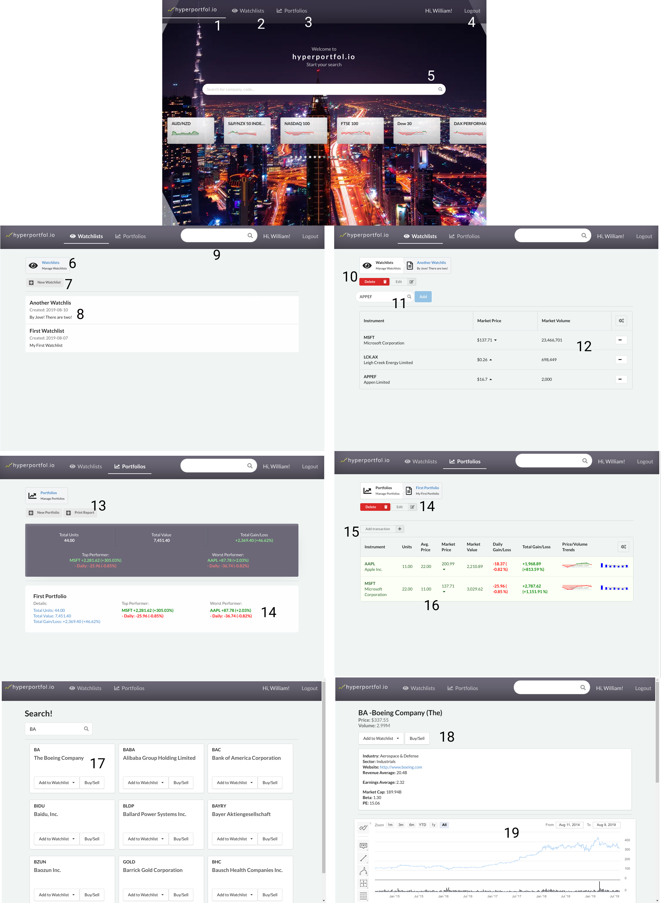{ width=750px } 

_User Walkthrough_

**The frames in order are**:

- A home screen of a logged in user.

- A watchlist list page, displaying watchlists of the logged in user.

- Stock information for stocks being watched in the selected watchlist.

- A Portfolio list page.

- A individual portfolio, and summaries of stocks in it.

- The results of a search for 'BA'.

- The Instrument Page of The Boeing Company.

**Elements observed are:**

1. Hyperportfolio logo which will take you back to dashboard
2. Navbar button to watchlists
3. Navbar button to posrtfolios
4. Navbar button to log out user
5. Search bar
6. A 'Step', these can be used to return to a previous page in the same area.
7. Button to create a new watchlist, will create a modal which requires a Name and Description.
8. A watchlist, these can be clicked to view a watchlist.
9. A search bar which will show options if left to load, or upon pressing enter will take you to the more extensive search page.
10. Buttons to delete and edit a watchlist.
11. A searchbar to add a given stock to the currently selected watchlist. One the stock is selected, the add button will be enabled allowing the stock to be added to the watchlist.
12. Stock symbols being watched.
13. Buttons to create a new watchlist or go to a report page where owned stocks can be printed or saved as a csv.
14. Buttons to delete or edit a portfolio.
15. Button to add a new transaction.
16. Information on owned stocks, grouped by symbol. Upon clicking one you will be taken to all transactions you have made for that stock.
17. A card, the title can be clicked to take you to a Instrument Page summarizing that stock. The button can also be added to a watchlist or added as a transaction to a portfolio through the "Add to watchlist" dropdown or "Buy/Sell" button respectively.
18. Options to add to a watchlist or portfolio (buy/sell).
19. Chart of stock.

## Appendix B Development Manual

#### Documentation

Both the backend and the frontend have significant commenting, and the frontend has some documentation hosted at [https://docs-hyperportfolio.netlify.com](https://docs-hyperportfolio.netlify.com/).

### Local Development

**Requirements**: docker, docker-compose, a stable internet connection.

There are a number of environment variables  which must be set. 

When developing locally, it is recommended you store your *server* environment variables in a `.env` file within the `src/` directory.

```sh
DEBUG=0
SECRET_KEY=<you can choose your own secure key>
SQL_ENGINE=django.db.backends.postgresql
SQL_DATABASE=stocks_django_prod
SQL_USER=stocks_django
SQL_PASSWORD=stocks_django
SQL_HOST=db
SQL_PORT=5432
DATABASE=postgres
RAPID_API_KEY=<Send an email to Mujeok Coderz to request this>
```

Most of these variables don't need to be secure for local development; however RapidAPI is a service which can be abused. If you choose to provide your own RapidAPI key then keep it secure; if you want to use ours for assessing the program please send us an email.

The site can be hosted locally using `docker-compose` up inside of the `src/` folder.

```sh
$ docker-compose up
Starting src_db_1 ... 
Starting src_nginx_1 ... 
```


## Appendix C Use Techniques and Source Code 
### C.1 Used Techniques

The project management approach taken was Agile.

As can be seen in section 2.1 - System Architecture, we used made use of Continuous integration and Continuous deployment (CI/CD), and automated testing. Additionally our project was dockerized for cross-compatibility  on the differing development environments of the team members, as well as preparedness for both the CI/CD pipeline and Amazon Web Service (AWS) hosting. An example of the devops cycle can be found below.

Additionally we followed the Client-Server pattern, with the server being an implementation of REST API. Django was set up following the Model-View-Controller (MVC) pattern, whilst React was set up as Pages-Helpers-Services. 

Python code was written to follow PEP-8 standard, and both JavaScript (JS) and JavaScript XML (JSX) was written to AirBnB ES6 standard, as measured by ESLint.


### C.2 Code Structure:

The code structure of the project is stored in a file called [code_structure.md](https://github.com/unsw-cse-comp3900-9900/capstone-project-mujeok_coderz/blob/master/report/code_structure.md) which is stored on the project github repository at https://github.com/unsw-cse-comp3900-9900/capstone-project-mujeok_coderz/blob/master/report/code_structure.md. Of key importance is that from the root of the code structure, there is a directory called `src`. Underneath that directory are two directories:
* `frontend` - This contains all the code for the React frontend code.
* `app` - This contains all the Django backend code.

## Appendix D Media

### D.1 UX: Demonstration of the site in action

<iframe height="480" width="720px" src="https://www.youtube.com/embed/HQH3R_z0vAQ" frameborder="0" allow="accelerometer; autoplay; encrypted-media; gyroscope; picture-in-picture" allowfullscreen></iframe>

https://www.youtube.com/watch?v=HQH3R_z0vAQ

### Devops: How our site is deployed from Master.

<iframe height="480" width="720px" src="https://www.youtube.com/embed/SV1-5yFzgKw" frameborder="0" allow="accelerometer; autoplay; encrypted-media; gyroscope; picture-in-picture" allowfullscreen></iframe>

https://www.youtube.com/watch?v=SV1-5yFzgKw

### Work Diaries 

[z5143237 - James Holman](https://github.com/unsw-cse-comp3900-9900/capstone-project-mujeok_coderz/blob/master/work_diaries/z5143237.txt)  
[z5146050 - Phet Photirath](https://github.com/unsw-cse-comp3900-9900/capstone-project-mujeok_coderz/blob/master/work_diaries/z5146050.txt)  
[z5116701 - Amri Chamela](https://github.com/unsw-cse-comp3900-9900/capstone-project-mujeok_coderz/blob/master/work_diaries/z5116701.txt)  
[z5115423 - Elisa Han](https://github.com/unsw-cse-comp3900-9900/capstone-project-mujeok_coderz/blob/master/work_diaries/z5115423.txt)  

### Link to Trello

[Mujeok Coderz Trello](https://trello.com/b/gJZEy80h/mujeokcoderz)

## Appendix E Third-Party Licenses

Proper references and brief descriptions of ALL third-party functionalities (clouds/services/APIs/libraries/code)  used  by  the  team, with justification for their use and discussion how their licensing terms impact results of this project.


As can be seen below from `licence-checker`; all used packages by the fronted were free and open-source, with the exception of Highcharts. For Highcharts, we used their free tier, which requires their watermark to be placed on graphs. As NPM typically uses an _enormous_ number of packages, this is the summaries of the licences rather than the individual packages themselves.

```
- MIT: 1325
- ISC: 99
- BSD-3-Clause: 66
- BSD-2-Clause: 33
- Apache-2.0: 29
- CC0-1.0: 26
- BSD*: 7
- MIT*: 3
- Public Domain: 2
- BSD: 2
- WTFPL: 2
- CC-BY-4.0: 1
- (MIT OR WTFPL): 1
- UNLICENSED: 1
- Unlicense: 1
- Custom: https://www.npmjs.com/package/highcharts-export-server: 1 
- AFLv2.1,BSD: 1
- (MIT OR Apache-2.0): 1
- Custom: https://github.com/dominictarr/event-stream: 1
- MPL-2.0: 1
- (BSD-3-Clause OR GPL-2.0): 1
- (MIT AND Zlib): 1
- (WTFPL OR MIT): 1
- MIT,Apache2: 1
- (BSD-2-Clause OR MIT OR Apache-2.0): 1
- (MIT AND BSD-3-Clause): 1
- CC-BY-3.0: 1
- BSD-Source-Code*: 1
- (Apache-2.0 OR MPL-1.1): 1
```

Additionally; these are the PIP packages used by Djano, as described by pip-licenses.

```
Django                         BSD                                                 
 Jinja2                        BSD                                                 
 MarkupSafe                    BSD-3-Clause                                        
 PyJWT                         MIT                                                 
 PyYAML                        MIT                                                 
 autopep8                      Expat License                                       
 certifi                       MPL-2.0                                             
 chardet                       LGPL                                                
 coreapi                       BSD                                                 
 coreschema                    BSD                                                 
 coverage                      Apache 2.0                                          
 django-cors-headers           MIT License                                         
 django-jenkins                LGPL                                                
 django-rest-swagger           FreeBSD License                                     
 djangorestframework           BSD                                                 
 djangorestframework-simplejwt MIT                                                 
 gunicorn                      MIT                                                 
 idna                          BSD-like                                            
 itypes                        BSD                                                 
 openapi-codec                 BSD                                                 
 pep8                          Expat license                                       
 pipfile                       BSD or Apache License, Version 2.0                  
 pycodestyle                   Expat license                                       
 pyflakes                      MIT                                                 
 pytz                          MIT                                                 
 requests                      Apache 2.0                                          
 simplejson                    MIT License                                         
 sqlparse                      BSD                                                 
 toml                          MIT                                                 
 uritemplate                   BSD 3-Clause License or Apache License, Version 2.0 
 urllib3                        MIT                                                
```

# References

1. AlphaVantage. (2019). *Free APIs for Historical Stock, Forex (FX), Cryptocurrency Data, Technical Analysis, and Charting*. [online] alphavantage.co. Available at https://www.alphavantage.co/ [Accessed 8 Aug 2019]
2. Amazon AWS. (2019). *Cloud computing services*. [online] aws.amazon.com. Available at: https://aws.amazon.com/ [Accessed 8 Aug 2019]
3. Bengtsson, P. (2019). *Best practice with retries with requests*. [online] Peterbe.com. Available at: https://www.peterbe.com/plog/best-practice-with-retries-with-requests [Accessed 10 Aug. 2019].
4. Chen, J. (2019). *What Is a Portfolio?*. [online] investopedia.com.  
    Available at: https://www.investopedia.com/terms/p/portfolio.asp [Accessed 9 Aug. 2019]
5. Commonwealth Bank. (2019). *What is short-selling?*. [online] Commsec.com.au. Available at: https://www.commsec.com.au/support/frequently-asked-questions/1401.html [Accessed 10 Aug. 2019].
6. Cypress. (2019). *JavaScript End to End Testing Framework*. [online] cypress.io. Available at: https://www.cypress.io/ [Accessed 9 Aug. 2019]
7. Django. (2019). *The Web framework for perfectionists with deadline*. [online] djangoproject.com. Available at https://www.djangoproject.com/ [Accessed 9 Aug. 2019]
8. Docker. (2019). *Enterprise Container Platform*. [online] docker.com. Available at: https://www.docker.com [Accessed 9 Aug. 2019]
9. Gunicorn (2019). *Python WSGI HTTP Server for UNIX*. [online] gunicorn.org. Available at: https://gunicorn.org/ [Accessed 9 Aug. 2019]
10. Highcharts. (2019). *Interractive JavaScript charts for your webpage*. [online] highcharts.com. Availble at: https://www.highcharts.com/ [Accessed 9 Aug 2019]
11. Nginx. (2019) *High Performance Load Balancer, Web Server, & Reverse Proxy*. [online] nginx.com. Available at: https://www.nginx.com/ [Accessed 9 Aug. 2019]
12. PostgreSQL. (2019). *The World's Most Advanced Open Source Relational Database*. [online] postgresql.org. Available at: https://www.postgresql.org/ [Accessed 8 Aug 2019]
13. Rapid API Yahoo! Finance. (2019). *Yahoo! FInance API Documentation*. [online] rapidapi.com. Available at https://rapidapi.com/apidojo/api/yahoo-finance1 [Accessed 8 Aug 2019]
14. React. (2019) *A JavaScript library for building user interfaces*. [online] reactjs.org. Available at: https://reactjs.org/ [Accessed 9 Aug. 2019]
15. Travis CI. (2019) *Test and Deploy Code with Confidence*. [online] travis-ci.org. Available at https://travis-ci.org/ [Accessed 9 Aug 2019]
16. Yahoo! Finance, (2019) [online] yahoo.com. Available at: https://au.finance.yahoo.com/ [Accessed 9 Aug. 2019].


